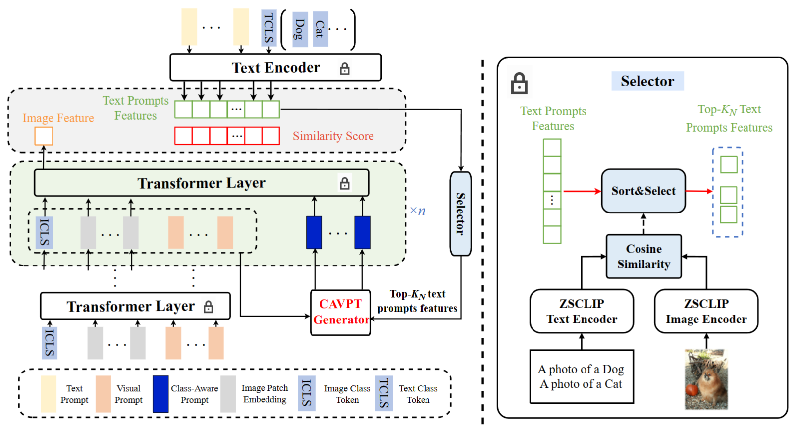

# Dual Modality Prompt Tuning for Vision-Language Pre-Trained Model
Yinghui Xing, Qirui Wu, De Cheng, Shizhou Zhang, Guoqiang Liang, Peng Wang, Yanning Zhang.

[Arxiv](https://arxiv.org/abs/2208.08340)   
[TMM](https://ieeexplore.ieee.org/abstract/document/10171397)   
*There is no difference between these two editions but only in Typesetting*.

## Overall Architecture


## How to install.

Please follow CoOp official code installation guide.

## How to run.

Please run `train_single.sh [SEED]`. Note that before you run our code, change DATASET and DATADIR to your dataset root. Change MODEL to run different methods. 
There are four methods(CoOp, VPT, VLP, DPT).

If our code didn\`t run properly. Please install CoOp official code and place our `trainers`, `train.py`, and `train_single.sh` into the same dir where CoOp is installed. 

## Citation
If you find our code or paper useful, please give us a citation.
```bash
@ARTICLE{10171397,
  author={Xing, Yinghui and Wu, Qirui and Cheng, De and Zhang, Shizhou and Liang, Guoqiang and Wang, Peng and Zhang., Yanning},
  journal={IEEE Transactions on Multimedia}, 
  title={Dual Modality Prompt Tuning for Vision-Language Pre-Trained Model}, 
  year={2023},
  volume={},
  number={},
  pages={1-13},
  doi={10.1109/TMM.2023.3291588}}
```
