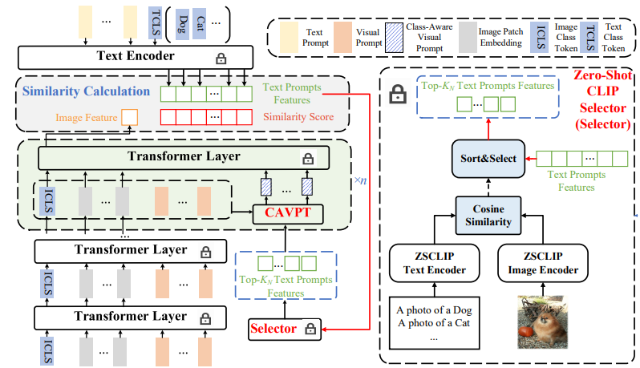

# 《Dual Modality Prompt Tuning for Vision-Language Pre-Trained Model》.

[arxiv](https://arxiv.org/abs/2208.08340)

## Overall Architecture


## How to install.

Please follow CoOp offical code installation guidence.

## How to run.

Please run `train_single.sh [SEED]`. Note that before you run our code, change DATASET and DATADIR to your dataset root. Change MODEL to run different methods. 
There are four methods(CoOp, VPT, VLP, DPT).

If our code didn\`t run properly. Please install CoOp offical code and place our `trainers` , `train.py`, and `train_single.sh` into the same dir where coop are installed. 

## Citation
If you find our code useful, please give us a citation.
```bash
@article{xing2022class,
  title={Class-aware visual prompt tuning for vision-language pre-trained model},
  author={Xing, Yinghui and Wu, Qirui and Cheng, De and Zhang, Shizhou and Liang, Guoqiang and Zhang, Yanning},
  journal={arXiv preprint arXiv:2208.08340},
  year={2022}
}
```
